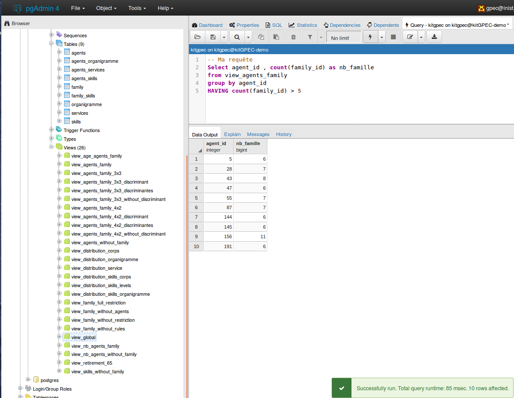

# GpecAnalyseur
Base de données permettant le traitements de compétences individuelles dans une démarche GPEC à partir d'un fichier Excel formalisé.

*Il est conseillé de regarder la documentation technique de la conception de la Base de donnée situé dans le dossier [/doc](../doc/) afin de comprendre son interaction entres les entités et sa normalisation.*

---------------------------------------------------------------------------

## Installation et Configuration 

### Prérequis
- Installer Docker ( via le site officiel :	https://docs.docker.com/engine/installation/linux/docker-ce/ubuntu/ )

### Préparation et mise à jour du fichier  **GpecAnalyseur.xlsm**

- Ouvrir le fichier  **KitGPEC.xlsm** et mettre à jour les onglets suivants :

  - Agents : contient la liste des agents dont les informations attendues sont détaillées ci-dessous. Penser à la compéter sur des agents partent ou arrivent dans l'organisation. Penser également à la compléter si des agents changent de corps et/ou de familles de compétence représentative.
    - Colonne A : contient un identifiant incrémentale et unique permettant d'identifier un agent qui est pseudonymisé dans cette table. C'est cet id qui permet aux équipes RH de faire le lien avec les données confidentielles (nommées et non anonymes).
    - Colonne B : contient la date de naissance de l'agent au format JJ/MM/AAAA
    - Colonne C : contient le type de contrat (CDD ou CDI)
    - Colonne D : contient le corps de l'agent (IR, IE, AI, T ou ATR)
    - Colonne E : contient l'identifiant court de la famille de compétence dont on retrouve le développé dans l'onglet **Familles**. C'est la famille de compétences représentative attendue pour l'agent en question. A noter qu'elle ne correspond pas au résultat de l'analyse des compétences individuelles de l'agent. Elle permet de vérifier la cohérence des règles d'association des compétences/familles et aussi de détecter des potentielles erreurs dans les compétences individuelles de l'agent.
  - Agents_Departements : contient la correspondance de l'agent à son département
    - Colonne A : contient l'identifiant de l'agent 
    - Colonne B : contient l'identifiant court du département
  - Agents_Services : contient la correspondance de l'agent à son service
    - Colonne A : contient l'identifiant de l'agent 
    - Colonne B : contient l'identifiant court du service
  - Agents_Comp : ne pas toucher, ni mettre à jour cet onglet car il sera automatiquement généré par la macro (voir plus bas)
  - Matrice_Agent_Comp : contient l'ensemble des compétences individuelles des agents avec leurs modulations. Cette matrice possède sur chaque lignes le code d'une compétences (colonne A) et sur chaque colonnes la modulation de la compétence en question pour chaque agent (colonnes B, C,D, ...). A noter que les modulations non entières (ex: 2,5) correspondent au fait que l'agent a indiqué lors de la saisie de son Kit GPEC (cf EAA) une modulation supérieur à celle attendue par son profil de poste. Cet onglet doit être mis à jour avec le résultat du traitement réalisé par la macro permettant de consolider l'ensembles des kits individuels en une matrice unique.
  - Competences : contient la liste de toutes les compétences référencés de notre EAA. 
    - Colonne A : contient le code unique de la compétence (composé suivant son type et son domaine ) 
    - Colonne B : contient le type de la compétence ( savoir, savoir être, savoir faire)
    - Colonne C : contient le domaine de la compétence (Communication, Général,Informatique ...)
    - Colonne D : contient le nom complet de la compétence 
    - Colonne E : contient l'id RéFérens nationnal du dictionnaire de compétence [](http://www.enseignementsup-recherche.gouv.fr/cid106062/referens-le-referentiel-2016-des-emplois-types-de-la-recherche-et-de-l-enseignement-superieur.html)(Extrait 2016)
  - Departements : contient l'ensemble des départements au sein de l'organisation
    - Colonne A : contient l'identifiant court du département 
    - Colonne B : contient la description détaillé du département
  - Famille_Comp: contient le code des compétences rattaché à chaque famille. De plus chaque compétence indiqué peut être discriminante ou non.  
    - Colonne A : contient l'identifiant court de la famille 
    - Colonne B : contient le code de la compétence
    - Colonne C : contient l'indication si la compétence est discriminante ou Non (Valeur : OUI ou NON)
  - Familles : contient la liste des familles de compétences de notre organisation ainsi que la régle que l'on veut appliquer dessus. Par défaut, pour rejoindre une famille, notre agent doit posséder au minimum un niveau 2 sur les compétences discriminantes de notre famille mais des régles peuvent être fixés suivant notre besoin (voir la colonne C pour plus de détail ).
    - Colonne A : contient l'identifiant court de la famille 
    - Colonne B : contient le nom complet de la famille
    - Colonne C : contient la régle de tri pour la famille si elle existe. Trois régles existent actuellement, notés 4X2 ou 3X3 ou case vide. 
      - 4X2 : signifie que les agents doivent posséder au minimum un niveau 2 minimum sur 4 compétences de la famille en incluant **obligatoirement** les discriminantes.
      - 3X3 : signifie que les agents doivent posséder au minimum un niveau 3 minimum sur 3 compétences de la famille en incluant **obligatoirement** les discriminantes.
      - case vide :  signifie que les agents doivent posséder au minimum un niveau 2  sur chaque compétence discriminante de la famille.
  - Services : contient l'ensemble des services au sein de l'organisation
    - Colonne A : contient l'identifiant court du service 
    - Colonne B : contient la description détaillé du service

  ​

### Importation des données depuis le fichier  **KitGPEC.xlsm**

* Déposer le fichier **KitGPEC.xlsm** à la racine

- Ouvrir le fichier **KitGPEC.xlsm** et extraire l'onglet  **Matrice_Agent_Comp** pour en générer un fichier CSV avec des **séparateurs de type points virgules**. Et déposer le fichier  **Matrice_Agent_Comp.csv** dans le répertoire ``script/``

- Lancer le script script/transpose.jar sur le fichier **Matrice_Agent_Comp.csv**

  ``` shell
  cd script/
  java -jar transpose.jar ./Matrice_Agent_Comp.csv
  ```

  Cela aura pour effet de générer un fichier **Matrice_Agent_Comp_final.csv** qui contiendra les même données mais transposées pour permettre aux scripts SQL de fonctionner.

- Ouvrir **Matrice_Agent_Comp_final.csv** et copier le contenu du premier (et unique) onglet et le coller dans l'onglet **Agents_Comp** du fichier **KitGPEC.xlsm** (normalement on se retrouve alors avec 3 colonnes et de très nombreuses lignes dans cet onglet)

- Lancer la macro **Export_CSV_Excel** contenue dans le fichier KitGPEC.xlsm ce qui aura pour effet de générer les fichiers CSV suivant à la racine qui correspondent aux N onglets du fichier KitGPEC.xlsm :
  - Agents.csv
  - Agents_Comp.csv
  - Agents_Departements.csv
  - Agents_Services.csv
  - Competences.csv
  - Departements.csv
  - Famille_Comp.csv
  - Familles.csv
  - Services.csv

- Déplacer les fichiers précédement listés dans le répertoire `sql/`

----------------------------------------

  ### Création de la BDD 
Pour créer les deux applications (base de données postgresql & interface d'administration pgadmin4) nécessaires au projet, nous devons exécuter la commande suivante en se situant à la racine du projet : 
```shell
make run
```
Cette commande aura comme effet de créer une base de données et d'y charger automatiquement l'ensemble des fichiers CSV précédement générés (ex: Services.csv, Competences.csv ...)

Afin de vérifier que tout s'est déroulé correctement, nous pouvons éxécuter la commande suivante : 

```shell
docker logs gpecanalyseur-db
```
Si la création a été un succés nous devons obtenir un affichage de ce type :


Notez le message **"PostgreSQL init process complete"** sans aucun message d'erreur au dessus.

------------------------------------------

  ### Configuration de PgAdmin4

Pour interagir avec les données de facon plus intuitif, pgAdmin4 doit être préalablement configuré manuellement.
  #### Accès à PgAdmin4
  - Accéder à PgAdmin4 via cette adresse (par défault) : [PgAdmin](http://localhost:5050/browser/)
  - Entrer le nom d'utilisateur et le mot de passe dans les champs requis.
    Par Défault : **email = gpec@inist.fr** and **password = gpecsecret** 
    (si vous souhaitez modifier ces identifiants, modifiez les préalablement dans le fichier [docker-compose.yml](../docker-compose.yml) avant de lancer ``make run``)

  

-------------------------------------------------

  #### Création du lien de connection à notre BDD
Maintenant pour relier notre Base De Donnée à PgAdmin4, nous faisons un clique-droit sur l'icone serveur à gauche et sélectionnons : **Create >  Server..**
  
​	
Un formulaire apparait, dans le premier onglet indiquez le nom de votre base de données : indiquez **gpecanalyseur**
(notez que dans la copie d'écran ci-dessous nous l'avons nommé **KitGPEC-demo**)

  
​	
Dans le deuxième onglet ("Connection"), on remplit les champs suivants comme suit :  

	| Champs           | Valeur par Défault | Variable dans docker-compose.debug.yml   |
	| ---------------- | ------------------ | ---------------------------------------- |
	| Host name/adress | gpecanalyseur-db         | nom de notre conteneur postgresql dans le fichier |
	| Username         | gpecanalyseur            | POSTGRES_USER                            |
	| Password         | gpecsecret         | POSTGRES_PASSWORD                        |

  
​	
Une fois validé via le bouton "Save", notre BDD est connectée et nous pouvons la parcourir en dévelopant les noeuds de l'arborescence.
  

------------------------------------------

  ## Visualisation et Interaction dans PgAdmin4 
Afin de pouvoir visualiser les données enregistrées et calculées, il nous suffit de naviguer dans l'arborescence de notre BDD pour trouver les Tables et les Vues qui permettront de récupérer les analyses qualitatives des compétences des agents.

  #### Arborescence de la BDD dans PgAdmin4
.  
+-- Servers  
|   +-- gpecanalyseur-demo
| 	|	+-- Databases  
|	|	|	+-- gpecanalyseur
|	|	|	|	+-- Casts
|	|	|	|	+-- Catalogs  
|	|	|	|	+-- .  
|	|	|	|	+-- .  
|	|	|	|	+-- .  
|	|	|	|	+-- Schemas  
|	|	|	|	|	+-- public  
|	|	|	|	|		+-- Collations  
|	|	|	|	|		+-- Domains  
|	|	|	|	|		+-- .  
|	|	|	|	|		+-- .  
|	|	|	|	|		+-- .  
|	|	|	|	|		+-- **Tables**  
|	|	|	|	|		+-- Trigger Functions  
|	|	|	|	|		+-- Types  
|	|	|	|	|		+-- **Views**  
|	|	|	|   
|	|	|   
|	|  
|  

#### Explications des Vues
Lors de la création de la BDD, un certain nombre de vue sont crées qui permettent de visualiser le résultat de l'analyse qualitative sur les compétences des agents. Elles peuvent être exportées au format tabulaire (CSV) pour pouvoir les manipuler dans un tableeur (ex: Excel) puis par exemple les intégrer dans des rapports GPEC consolidés par une analyse  verbale de ces chiffres. 

- *view_agents_family* :  La liste des familles et leurs agents qui leurs sont ratachés. Nous aurons plusieurs lignes possédant la même famille (colonne *family_id*) dans le cas où cette famille est associée à plusieurs agents (colonne *agent_id*). A noter également que nous retrouverons plusieurs agents sur plusieurs lignes dans le cas où ces agents possèdent plusieurs familles. Les *agent_id* correspondent aux identifiants que l'on retrouve dans l'onglet/table *Agents*.
- *view_age_agents_family* : La liste des familles et l'age moyen et médiane des agents la composant ainsi qu'hors CDD
  - Colonne *family_id* : indique le nom court de la famille de compétences dont on calcule la moyenne d'age
  - Colonne *moyenne_age* : indique la moyenne d'age des agents associés à la famille en question
  - Colonne *median_age* : indique la médianne des ages des agents associés à la famille en question
  - Colonne *moyenne_hors_cdd* : indique la moyenne d'age des agents (hors CDD) associés à la famille en question
  - Colonne *median_hors_cdd* : indique la médianne des ages des agents (hors CDD) associés à la famille en question
- *view_agents_without_family* : 'La liste des agents se retrouvant dans **aucune** famille
- *view_distribution_corps* : 'La liste des familles et la répartition des contrats et du corps des agents la composant
- *view_distribution_organigramme* : 'La liste des familles et la répartition du département des agents la composant
- *view_distribution_service* : La liste des familles et la répartition du service des agents la composant
- *view_global* : La liste des familles avec l'agent,sa date de naissance, son contrat,corps, département, service et les compétences de la famille ainsi que la note de l'agent
- *view_nb_agents_family* : Le nombre d'agents dans chaque famille
- *view_retirement_65* : Le nombre de départ à la retraite (65 ans) dans **5 ans** pour chaque famille

#### Visualiser les donnees

Une fois la vue choisie, il vous suffit de la sélectionner puis via un **clique-droit**  de choisir **View/Edit Data** > **All Rows** . La requête et le résultat s'affichera alors à droite. 
  


#### Executer une requête SQL (a passer dans la FAQ et préciser que c'est pour informaticien qui connait SQL)
PgAdmin4 permet d'exécuter des requêtes via son outil incorporé. 
Pour cela, allez dans l'onglet **Tools> Query Tool** 
  


Entrez votre requête SQL dans le champ prévu à cet effet, puis exécuter celle-ci via le bouton adéquat.
  


-----------------------------------

  ## FAQ

  ####  Lorsque je veux utiliser la macro dans Excel celle-ci n'apparait-pas à l'intérieur du fichier
  Les macros peuvent se récupérer dans le dossier ``macro/`` où se trouve deux fichiers correspondant à une version Excel et une pour OpenOffice. Ouvrez celle-convenue avec votre éditeur de Macro correspondant. 

 ####  Lors de la génération de la transposé de la matrice via le script java; j'obtiens diverses erreurs 
  Le script java a été conçu spécifiquement pour rececevoir des fichiers bien définis. Si jamais vous avez des erreurs lors de l'éxécution , vérifiez ces points : 
-le fichier .CSV d'entrée est bien au format CSV avec des ';'comme séparateur.
-il n'y a pas de données situées hors champs de la matrice 
-les cases correspondantes au niveau sont remplies avec un chiffre

 ####  Je souhaite exporter les données générés dans pgAdmin4 
  PgAdmin4 porpose une exportation des résultats des requêtes au format CSV. Pour celà, une fois votre requête exécutée, cliquez sur le bouton suivant ou sur la touche F8 de votre clavier : 
  


 ####  Je souhaite regénerer la BDD  suite à des modifications de fichiers 

  Si vous avez modifié des données dans le fichier Excel, alors regénerez à la main les fichier CSV comme indiqué au début puis lancer la commande docker suivante; à la racine du projet;  qui effacera votre BDD actuelle et la regénera avec les nouveaux fichiers sans besoin de reconfigurer pgAdmin4. 

```shell
make recreate
```

  **/!\ Attention !!**  Toutes vos modifications effectués sur la BDD actuelle seront définitivement effacées, il est conseillé de sauvegarder dans un dossier annexe le contenu du répertoire **/data/**.