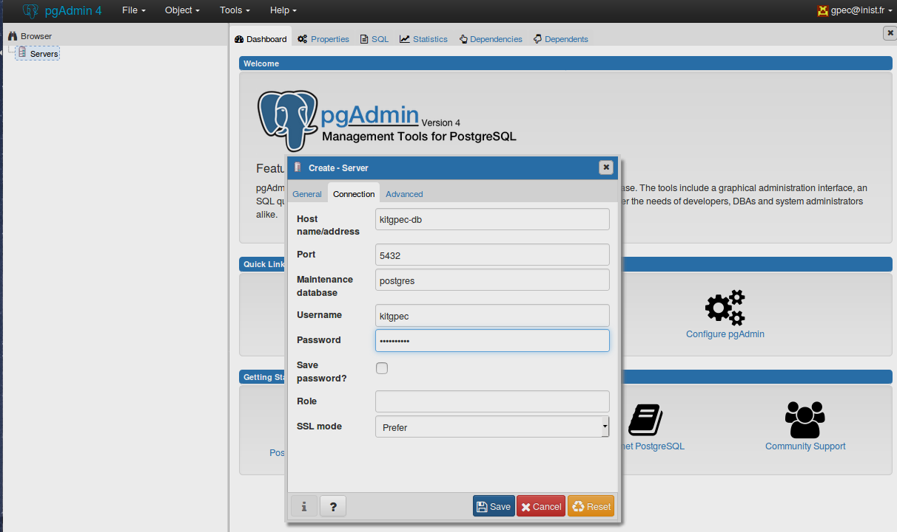

# KitGPEC
Base de données permettant le traitements de compétences individuelles dans une démarche GPEC à partir d'un fichier Excel formalisé.

*Il est conseillé de regarder la documentation technique de la conception de la Base de donnée situé dans le dossier [/doc](../doc/) afin de comprendre son interaction entres les entités et sa normalisation.*

---------------------------------------------------------------------------

## Installation et Configuration 

### Installation préambule
- Installer Docker ( via le site officiel :	https://docs.docker.com/engine/installation/linux/docker-ce/ubuntu/ )

### Importation des données depuis le fichier  **KitGPEC.xlsm**


- Déposer le fichier **KitGPEC.xlsm** à la racine

  - Ouvrir le fichier **KitGPEC.xlsm** et extraire l'onglet  **Matrice_Agent_Comp** pour en générer un fichier CSV avec des **séparateurs de type points virgules**. Et déposer le fichier  **Matrice_Agent_Comp.csv** dans le répertoire ``script/``

- Lancer le script script/transpose.jar sur le fichier **Matrice_Agent_Comp.csv**

  ``` shell
  cd script/
  java -jar transpose.jar ./Matrice_Agent_Comp.csv
  ```

  Cela aura pour effet de générer un fichier 	**Matrice_Agent_Comp_final.csv** qui contiendra les même données mais transposées pour permettre aux scripts SQL de fonctionner.

- Ouvrir **Matrice_Agent_Comp_final.csv** et copier le contenu du premier (et unique) onglet et le coller dans l'onglet **Agents_Comp** du fichier **KitGPEC.xlsm** (normalement on se retrouve alors avec 3 colonnes et de très nombreuses lignes dans cet onglet)

- Lancer la macro **Export_CSV_Excel** contenue dans le fichier KitGPEC.xlsm ce qui aura pour effet de générer les fichiers CSV suivant à la racine qui correspondent aux N onglets du fichier KitGPEC.xlsm :
  - Agents.csv
  - Agents_Comp.csv
  - Agents_Departements.csv
  - Agents_Services.csv
  - Competences.csv
  - Departements.csv
  - Famille_Comp.csv
  - Familles.csv
  - Services.csv

- Déplacer les fichiers précédement listés dans le répertoire `sql/`

----------------------------------------

  ### Création de la BDD et de PgADmin4 
  Pour créer les deux images nécessaires au projet, nous devons exécuter la commande suivante en se situant à la racine du projet : 
```shell
    make run
```
  Afin de vérifier que tout s'est déroulé correctement, nous pouvons éxécuter la commande suivante : 
```shell
 docker logs kitgpec-db
```
  Si la création a été un succés nous devons obtenir un affichage de ce type :

------------------------------------------

  ### Configuration de PgAdmin4

  Pour interagir avec les données de facon plus intuitif, pgAdmin4 doit être configuré manuellement.
  #### Accès à PgAdmin4
  - Accéder à PgAdmin4 via cette adresse (par défault) : [PgAdmin]	(http://http://localhost:5050/browser/)

  Entrer le nom d'utilisateur et le mot de passe dans les champs requis.(The values are in the file [docker-compose.yml](../docker-compose.yml))
​	
  Par Défault : **email = gpec@inist.fr** and **password = gpecsecret** 
  

-------------------------------------------------

  #### Création du lien de connection à notre BDD
  Maintenant pour relier notre Base De Donnée à PgAdmin4, nous faisons 	un clique-droit sur l'icone serveur à gauche et sélectionnons : 	**Create >  Server..**
  
​	
  Un formulaire apparait, dans le premier onglet nous renseignons le nom que portera notre BDD (ici nous l'appelons KitGPEC-demo)
  
​	
  Dans le deuxième onglet ("Connection"), on remplit les champs suivants comme suit :  

	| Champs           | Valeur par Défault | Variable dans docker-compose.debug.yml   |
	| ---------------- | ------------------ | ---------------------------------------- |
	| Host name/adress | kitgpec-db         | nom de notre conteneur postgresql dans le fichier |
	| Username         | kitgpec            | POSTGRES_USER                            |
	| Password         | gpecsecret         | POSTGRES_PASSWORD                        |

  
​	
  Une fois validé via le bouton "Save", notre BDD est connectée et nous pouvons la parcourir en dévelopant les noeuds de l'arborescence.
​	
  

------------------------------------------

  ## Visualisation et Interaction dans PgAdmin4 
 Afin de pouvoir visualiser les données enregistrées et calculées, il nous suffit de naviguer dans l'arborescence de notre BDD pour trouver les Tables et les Vues.

  #### Arborescence de la BDD dans PgAdmin4
.  
+-- Servers  
|   +-- kitGPEC-demo  
| 	|	+-- Databases  
|	|	|	+-- kitgpec  
|	|	|	|	+-- Casts  
|	|	|	|	+-- Catalogs  
|	|	|	|	+-- .  
|	|	|	|	+-- .  
|	|	|	|	+-- .  
|	|	|	|	+-- Schemas  
|	|	|	|	|	+-- public  
|	|	|	|	|		+-- Collations  
|	|	|	|	|		+-- Domains  
|	|	|	|	|		+-- .  
|	|	|	|	|		+-- .  
|	|	|	|	|		+-- .  
|	|	|	|	|		+-- **Tables**  
|	|	|	|	|		+-- Trigger Functions  
|	|	|	|	|		+-- Types  
|	|	|	|	|		+-- **Views**  
|	|	|	|   
|	|	|   
|	|  
|  


  #### Visualiser les donnees
  Une fois choisi, il nous suffit de la sélectionner puis via un **clique-droit**  de choisir **View/Edit Data** > **All Rows** . La requête et le résultat s'affichera alors à droite. 
  


#### Explications des Vues
  Lors de la création de la BDD, un certain nombre de vue se sont crées afin de faciliter la lecture et l'interaction entre les données. Voici une liste non exhaustive des plus importantes : 

- *view_agents_family* :  La liste des familles et leurs agents qui leurs sont ratachés. 
- *view_age_agents_family* : La liste des familles et l'age moyen et médiane des agents la composant ainsi qu'hors CDD
- *view_agents_without_family* : 'La liste des agents se retrouvant dans **aucune** famille
- *view_distribution_corps* : 'La liste des familles et la répartition des contrats et du corps des agents la composant
- *view_distribution_organigramme* : 'La liste des familles et la répartition du département des agents la composant
- *view_distribution_service* : La liste des familles et la répartition du service des agents la composant
- *view_global* : La liste des familles avec l'agent,sa date de naissance, son contrat,corps, département, service et les compétences de la famille ainsi que la note de l'agent
- *view_nb_agents_family* : Le nombre d'agents dans chaque famille
- *view_retirement_65* : Le nombre de départ à la retraite (65 ans) dans **5 ans** pour chaque famille

#### Executer une requête SQL
PgAdmin4 permet d'exécuter des requêtes via son outil incorporé. 
Pour cela, allez dans l'onglet **Tools> Query Tool** 
  


  Entrez votre requête SQL dans le champ prévu à cet effet, puis exécuter celle-ci via le bouton adéquat.
  


-----------------------------------

  ## FAQ

  ####  Lorsque je veux utiliser la macro dans Excel celle-ci n'apparait-pas à l'intérieur du fichier
	Les macros peuvent se récupérer dans le dossier ``macro/`` où se trouve deux fichiers correspondant à une version Excel et une pour OpenOffice. Ouvrez celle-convenue avec votre éditeur de Macro correspondant. 

 ####  Lors de la génération de la transposé de la matrice via le script java; j'obtiens diverses erreurs 
	Le script java a été conçu spécifiquement pour rececevoir des fichiers bien définis. Si jamais vous avez des erreurs lors de l'éxécution , vérifiez ces points : 
-le fichier .CSV d'entrée est bien au format CSV avec des ';'comme séparateur.
-il n'y a pas de données situées hors champs de la matrice 
-les cases correspondantes au niveau sont remplies avec un chiffre

 ####  Je souhaite exporter les données générés dans pgAdmin4 
 	PgAdmin4 porpose une exportation des résultats des requêtes au format CSV. Pour celà, une fois votre requête exécutée, cliquez sur le bouton suivant ou sur la touche F8 de votre clavier : 
  


 ####  Je souhaite regénerer la BDD  suite à des modifications de fichiers 

	Si vous avez modifié des données dans le fichier Excel, alors regénerez à la main les fichier CSV comme indiqué au début puis lancer la commande docker suivante; à la racine du projet;  qui effacera votre BDD actuelle et la regénera avec les nouveaux fichiers sans besoin de reconfigurer pgAdmin4. 

```shell
	    make recreate
```

​	 **/!\ Attention !!**  Toutes vos modifications effectués sur la BDD actuelle seront définitivement effacées, il est conseillé de sauvegarder dans un dossier annexe le contenu du répertoire **/data/**.