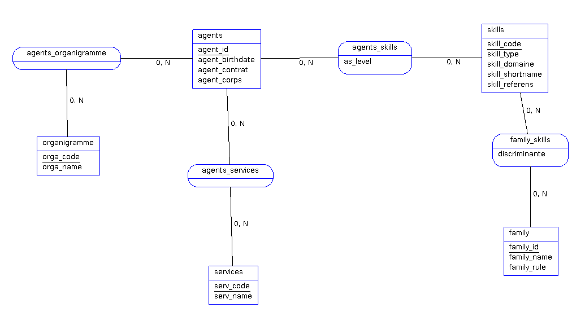

# Developer documentation

## Data conception

[AnalyseSI file](./KITgpec.asi) (*site to download* : https://launchpad.net/analysesi ) used to generate [MCD.png](./MCD.png)

SQL scripts to generate this database and the views are located in the folder [/sql](../sql/) and are executed automaticly at initialisation of container.

The databatase datas are saving in the volume [/data](../data/).

